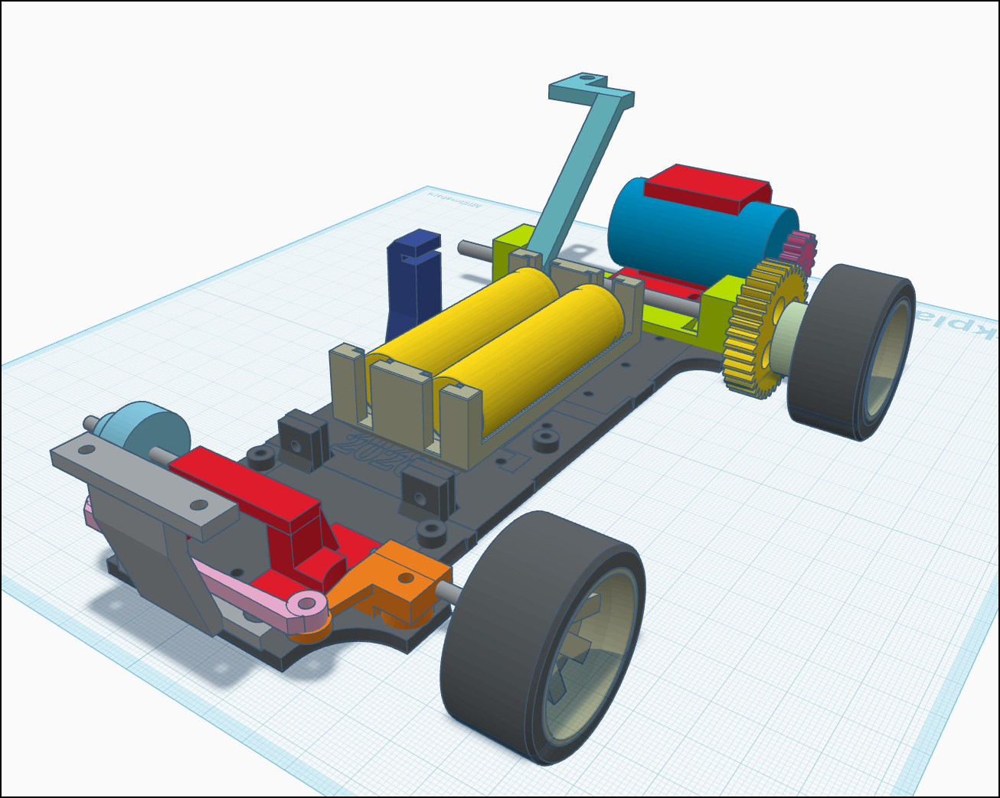
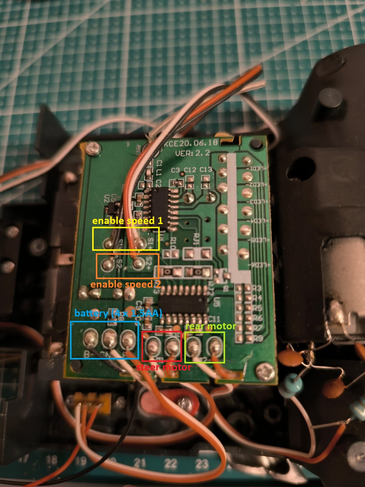
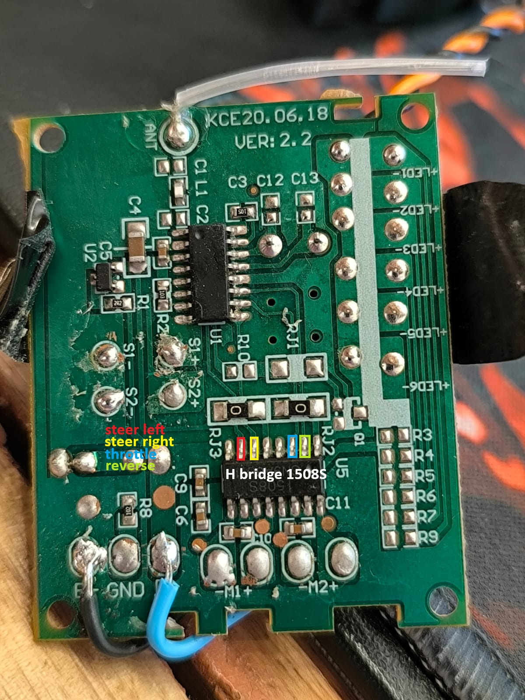
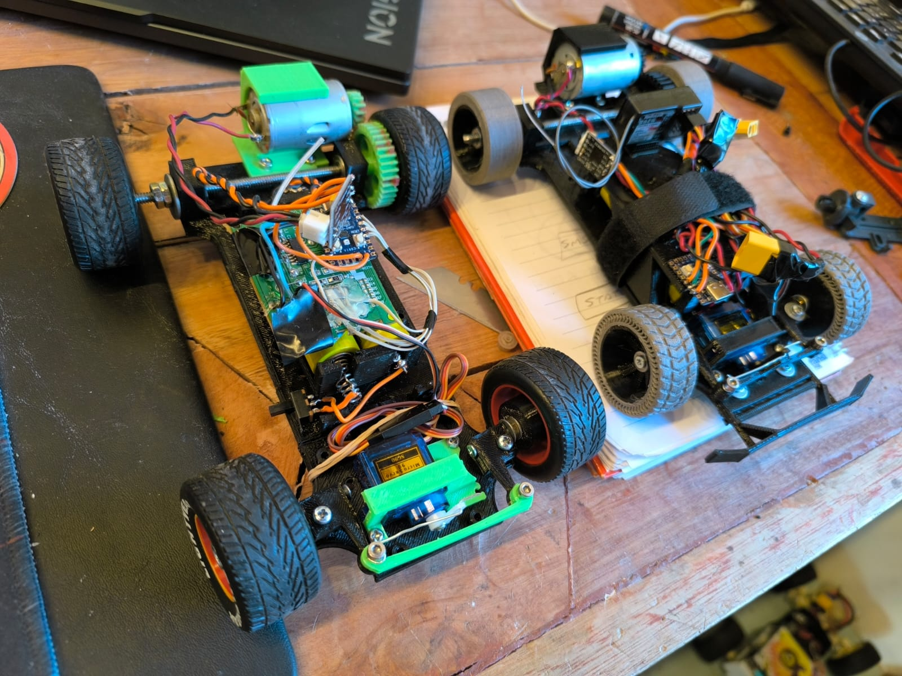

# McQueen RC Car Hack
So this is an improvement to Disney stock Lightning McQueen RC Car.

I already made a RC Car using this chassis, electronic and mechanics, so decided to hack into this toy to make races with my nephew

- the RC receiver will remain the same but driven by 5v step up
- the rear motor will be driven by a DRV8833 at 7.4v
- the steer will be driven by a microservo
- the "converter" will be a RP2040 Zero, small and powerfull

So instead of feeding the motor, I will feed the RP2040 and it will convert into signals for the DRV8833 and microservo

## Materials:

- RC Car with transmitter and receiver (in this case a RC McQueen)
- RP2040 Zero or some small 5v Arduino
- Step-down converter 7.4 to 5v
- DRV8833 or similar
- 5v Micro servo
- DC Motor (whatever you can get)
- 2 x 18650 3.7 battery

## 3D Models
https://www.tinkercad.com/things/1ACjphVFdlr-mcqueen-hack-2026/edit?returnTo=%2Fdashboard%2Fdesigns%2F3d



## Setup for RP2040 Zero

1. **Install Arduino IDE / CLI**
   - Download [Arduino IDE](https://www.arduino.cc/en/software) or install `arduino-cli` via package manager.

2. **Add RP2040 Board Support**
   - In Arduino IDE: `Preferences` → `Additional Boards Manager URLs`, add:
     ```
     https://github.com/earlephilhower/arduino-pico/releases/download/global/package_rp2040_index.json
     ```
   - Then `Tools` → `Board Manager` → search `RP2040` → install **Raspberry Pi RP2040 (Earle Philhower)**.

3. **Select Board & Port**
   - `Tools` → `Board` → `Raspberry Pi RP2040 / Raspberry Pi Pico`
   - `Tools` → `Port` → select your USB port (e.g., `COM3`)

4. **Upload Sketch**
   - Hold the `BOOT` button on RP2040 Zero, connect USB, then release.
   - Click **Upload** in Arduino IDE, or use:
     ```
     arduino-cli upload --fqbn rp2040:rp2040:raspberry_pi_pico --port COM3 src/rp2040-zero/rp2040-zero.ino
     ```

## Code in /src

- **File**: `src/rp2040-zero/rp2040-zero.ino`: Arduino sketch for an RP2040 Zero that converts receiver signals into motor, steering and status-LED outputs.
- **Inputs**: reads receiver channels (`THR_FWD`, `THR_REV`, `DIR_LEFT`, `DIR_RIGHT`) to determine throttle and steering commands.
- **Outputs**: drives motor driver pins (`IN1`, `IN2`) using PWM, controls a steering `Servo` on `SERVO_PIN`, and updates an onboard NeoPixel for status indications.
- **Behavior**: sets the servo to left/center/right based on direction inputs; sets motor speed to full forward, full reverse, or stop; an optional acceleration ramp (controlled by `USE_ACCEL_RAMP`) smoothly changes `currentSpeed` toward `targetSpeed`.
- **Configuration**: constants at the top define pin assignments, servo angles (`SERVO_LEFT`, `SERVO_CENTER`, `SERVO_RIGHT`), PWM settings, and acceleration/brake steps (`ACCEL_STEP`, `BRAKE_STEP`).
- **Status LED**: blue when stopped, green for forward, red for reverse.

.jpeg>)
.jpeg>)
.jpeg>)



